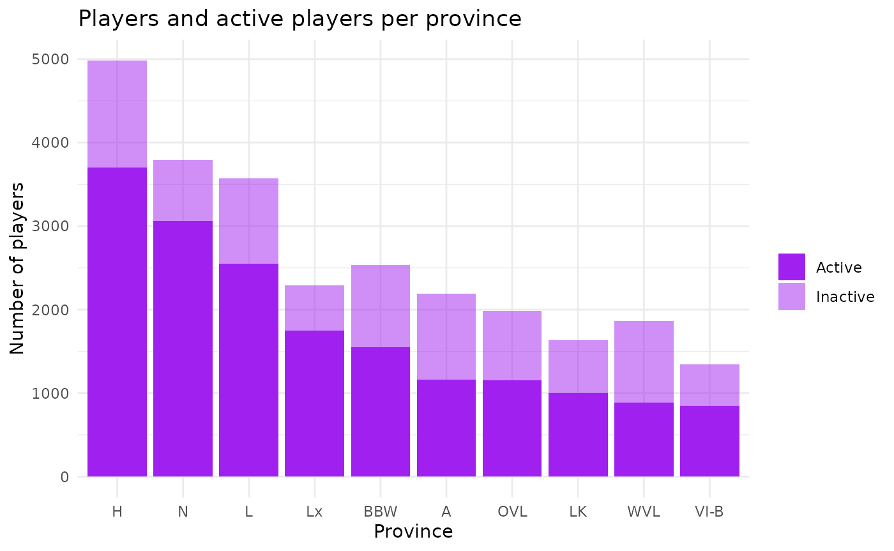
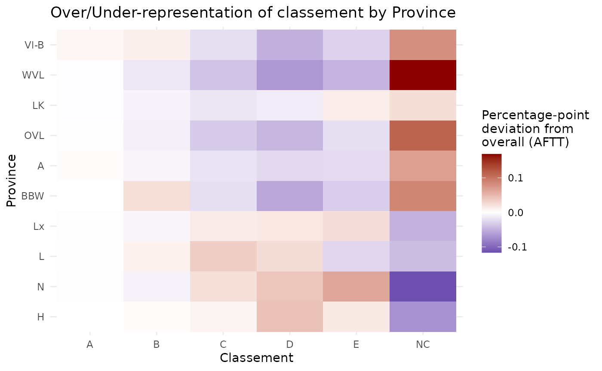
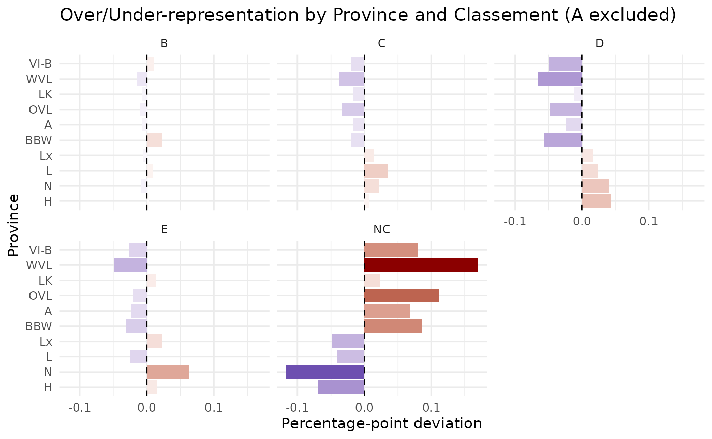

# Province Analysis

``` r

library(PingMeUp)
data("players_m", package = "PingMeUp")

library(ggridges)
library(ggplot2)
```

### Distribution of players and actives across provinces

``` r

# Plot players actives and non-actives
df <- data.frame(
  prov = names(table(players_m$prov)),
  p = as.numeric(table(players_m$prov)),
  a = as.numeric(table.actives.prov())
)

df <- df[order(df$a, decreasing = TRUE), ]
df$prov <- factor(df$prov, levels = df$prov)
prov_order <- df$prov

ggplot(data = df) +
  geom_bar(aes(x = prov, y = p, alpha = "Inactive"),
           stat = "identity", fill = "purple") +
  geom_bar(aes(x = prov, y = a, alpha = "Active"),
           stat = "identity", fill = "purple") +
  scale_alpha_manual(
    name = "",
    values = c("Inactive" = 0.5, "Active" = 1)
  ) +
  labs(x = "Province", y = "Number of players",
       title = "Players and active players per province") +
  theme_minimal()
```



graph.players.prov

### Analysis of current percentage of each classement

Plot of the frequency of each classement for active players for each
province. The pink bar indicates the percentage of players in each
classement letter as of the AFTT grille (average, i.e. see
share.m.B2toNC()).

``` r

lapply(as.character(prov_order), function(p) {
  p.df <- players_m[players_m$prov == p, ]

  graph.pct.classements(
    p.df,
    ylim_max = 0.5,
    title = paste(p, "Part des classements")
  ) + geom.pct.classements.grille()
})
```

    ## Best guess cumulated percentage based on means across columns of the provided grille. Excludes A's and B0 players as their number is fixed
    ## Best guess cumulated percentage based on means across columns of the provided grille. Excludes A's and B0 players as their number is fixed
    ## Best guess cumulated percentage based on means across columns of the provided grille. Excludes A's and B0 players as their number is fixed
    ## Best guess cumulated percentage based on means across columns of the provided grille. Excludes A's and B0 players as their number is fixed
    ## Best guess cumulated percentage based on means across columns of the provided grille. Excludes A's and B0 players as their number is fixed
    ## Best guess cumulated percentage based on means across columns of the provided grille. Excludes A's and B0 players as their number is fixed
    ## Best guess cumulated percentage based on means across columns of the provided grille. Excludes A's and B0 players as their number is fixed
    ## Best guess cumulated percentage based on means across columns of the provided grille. Excludes A's and B0 players as their number is fixed
    ## Best guess cumulated percentage based on means across columns of the provided grille. Excludes A's and B0 players as their number is fixed
    ## Best guess cumulated percentage based on means across columns of the provided grille. Excludes A's and B0 players as their number is fixed

    ## [[1]]


graph.pct.classements.prov

    ## 
    ## [[2]]


graph.pct.classements.prov

    ## 
    ## [[3]]


graph.pct.classements.prov

    ## 
    ## [[4]]


graph.pct.classements.prov

    ## 
    ## [[5]]


graph.pct.classements.prov

    ## 
    ## [[6]]


graph.pct.classements.prov

    ## 
    ## [[7]]


graph.pct.classements.prov

    ## 
    ## [[8]]


graph.pct.classements.prov

    ## 
    ## [[9]]


graph.pct.classements.prov

    ## 
    ## [[10]]


graph.pct.classements.prov

### Over/under representation of a classement in a province compared to overall?

``` r

tab <- table(players_m$prov, players_m$classement_lettre)

prop_prov <- prop.table(tab, 1)
prop_all <- prop.table(colSums(tab))

diff <- sweep(prop_prov, 2, prop_all, "-")

df_long <- as.data.frame(as.table(diff))
colnames(df_long) <- c("prov", "classement.l", "diff")

df_long$prov <- factor(df_long$prov, levels = prov_order)
```

``` r

ggplot(df_long, aes(x = classement.l, y = prov, fill = diff)) +
  geom_tile() +
  scale_fill_gradient2(
    low = "darkblue",
    mid = "white",
    high = "darkred",
    midpoint = 0,
    name = "Percentage-point\ndeviation from\noverall (AFTT)"
  ) +
  labs(
    title = "Over/Under-representation of classement by Province",
    x = "Classement",
    y = "Province"
  ) +
  theme_minimal()
```



Or slightly cleaner maybe:

``` r

df_long2 <- df_long[df_long$classement.l != "A",]

ggplot(df_long2, aes(x = prov, y = diff, fill = diff)) +
  geom_col() +
  coord_flip() +
  geom_hline(yintercept = 0, linetype = "dashed") +
  facet_wrap(~classement.l) +
  scale_fill_gradient2(
    low = "darkblue",
    mid = "white",
    high = "darkred",
    midpoint = 0,
    guide = "none"
  ) +
  labs(
    title = "Over/Under-representation by Province and Classement (A excluded)",
    x = "Province",
    y = "Percentage-point deviation"
  ) +
  theme_minimal()
```



There is not only more players in the French speaking provinces but also
sytematically less NC in relative terms, indicating a stronger
engagement in table tennis as a competitive sport.

## Province season scores adjusted for classement structure

Compare total points per province to their expected values given the
distribution of classements at the start of the season within each
province. This corrects for compositional effects (e.g. differences in
the proportion of NC players across provinces). The expected points are
computed by assigning each player the average point value of their
classement and aggregating by province. The difference between actual
and expected points indicates whether a province is overperforming or
underperforming relative to its classement structure.

``` r

active_noa <- players_m[
  players_m$position_bis != "Inactive" &
  players_m$classement_lettre != "A",
]
mean_class <- tapply(active_noa$points,
                     active_noa$classement,
                     mean,
                     na.rm = TRUE)
active_noa$expected_points <- mean_class[active_noa$classement]

active_noa$diff_points <- active_noa$points - active_noa$expected_points
prov_diff_mean <- aggregate(diff_points ~ prov, data = active_noa, mean)
prov_diff_mean
```

    ##    prov diff_points
    ## 1     A   22.520401
    ## 2   BBW   -3.353309
    ## 3     H  -10.989728
    ## 4     L   -8.158971
    ## 5    LK    1.226117
    ## 6    Lx  -14.762058
    ## 7     N  -12.575752
    ## 8   OVL   22.760192
    ## 9  Vl-B   56.455347
    ## 10  WVL   33.750911

Where we see the compositional effect seems to reappear. This is because
1 point in the lower classements more easily leads to a classement
change than in the higher classements (by construction of the
classements). This nonlinearity needs to be accounted for. One way is to
standardize the deviations to the mean per classement, which gives us a
sort of “z-score” of performance relative to the expected points for
that classement. A second manner is to compute the rank within each
classement, which is more robust to outliers and non-normality of points
distribution.

``` r

active_noa$z_points <- ave(active_noa$points,
                            active_noa$classement,
                            FUN = function(x) (x - mean(x)) / sd(x))
prov_zscore_mean <- aggregate(z_points ~ prov, data = active_noa, mean)
prov_zscore_mean
```

    ##    prov     z_points
    ## 1     A  0.204297810
    ## 2   BBW -0.026494142
    ## 3     H -0.095898549
    ## 4     L -0.072809040
    ## 5    LK -0.002166883
    ## 6    Lx -0.133239422
    ## 7     N -0.108150412
    ## 8   OVL  0.195464035
    ## 9  Vl-B  0.500463068
    ## 10  WVL  0.298582816

``` r

active_noa$p_points <- ave(active_noa$points,
                            active_noa$classement,
                            FUN = function(x) rank(x) / length(x))
prov_pscore_mean <- aggregate(p_points ~ prov, data = active_noa, mean)
prov_pscore_mean
```

    ##    prov  p_points
    ## 1     A 0.5578350
    ## 2   BBW 0.4902112
    ## 3     H 0.4724433
    ## 4     L 0.4796219
    ## 5    LK 0.5031363
    ## 6    Lx 0.4612839
    ## 7     N 0.4674905
    ## 8   OVL 0.5575985
    ## 9  Vl-B 0.6334110
    ## 10  WVL 0.6083905

The higher performance of provinces with less and lower classments is
still there, suggesting a structural effect of the progression system
rather than a true provincial effect. The only way out is to model
points as a function of classement and average residuals or also
including a province fixed effect:

``` r

#Note: classment is a factor but unordered to let the model decide on coef without assuming linearity with points.
# Refs for easier reading: "Hainaut" and "NC" as baselines:
active_noa$prov <- relevel(factor(active_noa$prov), ref = "H")
active_noa$classement <- relevel(factor(active_noa$classement), ref = "NC")

pts_model <- lm(points ~ classement, data = active_noa)
summary(pts_model)
```

    ## 
    ## Call:
    ## lm(formula = points ~ classement, data = active_noa)
    ## 
    ## Residuals:
    ##     Min      1Q  Median      3Q     Max 
    ## -435.72  -73.27  -13.64   57.34  863.55 
    ## 
    ## Coefficients:
    ##              Estimate Std. Error t value Pr(>|t|)    
    ## (Intercept)   113.966      2.119   53.79   <2e-16 ***
    ## classementB0 2361.188     13.864  170.31   <2e-16 ***
    ## classementB2 2119.395      8.718  243.11   <2e-16 ***
    ## classementB4 1894.314      7.023  269.74   <2e-16 ***
    ## classementB6 1709.290      5.522  309.54   <2e-16 ***
    ## classementC0 1553.567      5.035  308.58   <2e-16 ***
    ## classementC2 1397.202      4.503  310.29   <2e-16 ***
    ## classementC4 1250.666      4.157  300.83   <2e-16 ***
    ## classementC6 1124.897      4.045  278.11   <2e-16 ***
    ## classementD0  993.535      4.009  247.81   <2e-16 ***
    ## classementD2  874.867      3.954  221.26   <2e-16 ***
    ## classementD4  759.273      3.892  195.07   <2e-16 ***
    ## classementD6  658.481      3.743  175.93   <2e-16 ***
    ## classementE0  536.579      3.866  138.80   <2e-16 ***
    ## classementE2  411.074      3.556  115.60   <2e-16 ***
    ## classementE4  272.797      3.340   81.67   <2e-16 ***
    ## classementE6  118.667      3.358   35.34   <2e-16 ***
    ## ---
    ## Signif. codes:  0 '***' 0.001 '**' 0.01 '*' 0.05 '.' 0.1 ' ' 1
    ## 
    ## Residual standard error: 109.6 on 17607 degrees of freedom
    ## Multiple R-squared:  0.9603, Adjusted R-squared:  0.9603 
    ## F-statistic: 2.663e+04 on 16 and 17607 DF,  p-value: < 2.2e-16

``` r

pts_model_prov <- lm(points ~ classement + prov, data = active_noa)
summary(pts_model_prov)
```

    ## 
    ## Call:
    ## lm(formula = points ~ classement + prov, data = active_noa)
    ## 
    ## Residuals:
    ##     Min      1Q  Median      3Q     Max 
    ## -424.66  -71.61  -13.70   56.97  803.07 
    ## 
    ## Coefficients:
    ##              Estimate Std. Error t value Pr(>|t|)    
    ## (Intercept)    99.358      2.658  37.378  < 2e-16 ***
    ## classementB0 2359.394     13.659 172.740  < 2e-16 ***
    ## classementB2 2118.586      8.593 246.538  < 2e-16 ***
    ## classementB4 1894.886      6.918 273.921  < 2e-16 ***
    ## classementB6 1714.017      5.446 314.716  < 2e-16 ***
    ## classementC0 1557.115      4.965 313.638  < 2e-16 ***
    ## classementC2 1400.937      4.440 315.506  < 2e-16 ***
    ## classementC4 1254.657      4.103 305.775  < 2e-16 ***
    ## classementC6 1129.184      3.990 282.980  < 2e-16 ***
    ## classementD0  999.261      3.960 252.321  < 2e-16 ***
    ## classementD2  879.408      3.904 225.256  < 2e-16 ***
    ## classementD4  763.976      3.843 198.785  < 2e-16 ***
    ## classementD6  662.235      3.695 179.214  < 2e-16 ***
    ## classementE0  542.357      3.820 141.969  < 2e-16 ***
    ## classementE2  417.415      3.517 118.691  < 2e-16 ***
    ## classementE4  277.628      3.300  84.137  < 2e-16 ***
    ## classementE6  117.391      3.313  35.429  < 2e-16 ***
    ## provA          33.799      3.641   9.284  < 2e-16 ***
    ## provBBW         8.258      3.279   2.518 0.011798 *  
    ## provL           2.932      2.786   1.053 0.292557    
    ## provLK         13.059      3.864   3.380 0.000727 ***
    ## provLx         -3.606      3.140  -1.149 0.250745    
    ## provN          -1.605      2.643  -0.607 0.543549    
    ## provOVL        34.581      3.654   9.463  < 2e-16 ***
    ## provVl-B       68.746      4.150  16.564  < 2e-16 ***
    ## provWVL        45.565      4.055  11.237  < 2e-16 ***
    ## ---
    ## Signif. codes:  0 '***' 0.001 '**' 0.01 '*' 0.05 '.' 0.1 ' ' 1
    ## 
    ## Residual standard error: 107.9 on 17598 degrees of freedom
    ## Multiple R-squared:  0.9615, Adjusted R-squared:  0.9615 
    ## F-statistic: 1.76e+04 on 25 and 17598 DF,  p-value: < 2.2e-16

``` r

active_noa$residuals <- pts_model$residuals
prov_resid_mean <- aggregate(residuals ~ prov, data = active_noa, mean)
prov_resid_mean
```

    ##    prov  residuals
    ## 1     H -10.989728
    ## 2     A  22.520401
    ## 3   BBW  -3.353309
    ## 4     L  -8.158971
    ## 5    LK   1.226117
    ## 6    Lx -14.762058
    ## 7     N -12.575752
    ## 8   OVL  22.760192
    ## 9  Vl-B  56.455347
    ## 10  WVL  33.750911

Classement’s related coefficients shows expected mean point for each
classement and their gaps show existing non-linearity. Those
coefficients barely change when provinces are added.

Both residuals aggregation from the base model or the province
coefficients in the fixed effect model confirm that, once we control for
the classements structure, Flemish speaking provinces perform higher,
i.e. more points than expected. In terms of provinces, the French
speaking regions are barely different to the baseline (Hainaut).

Across multiple normalization strategies (fixed effects model, residuals
of classement-points model, within-class z-scores, or rank-based
scores), Flemish-speaking provinces systematically exhibit higher
average performance indicators.

It goes in line with the first part which showed that French-speaking
provinces tend to have a much higher share of activated players,
suggesting a different sport ecosystem overall: more inclusive
competition, i.e. more recreational players entering official or
remaining active in competition in French speaking provinces. Solving
the composition bias does not necessarily solves a potential selection
bias.
