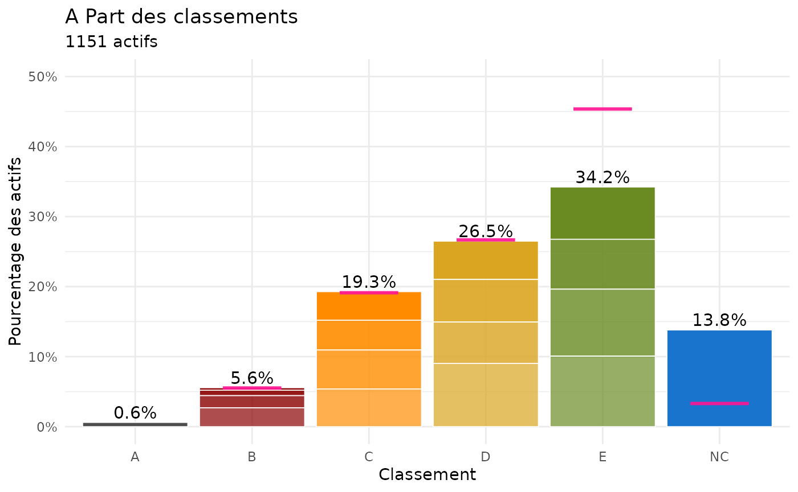
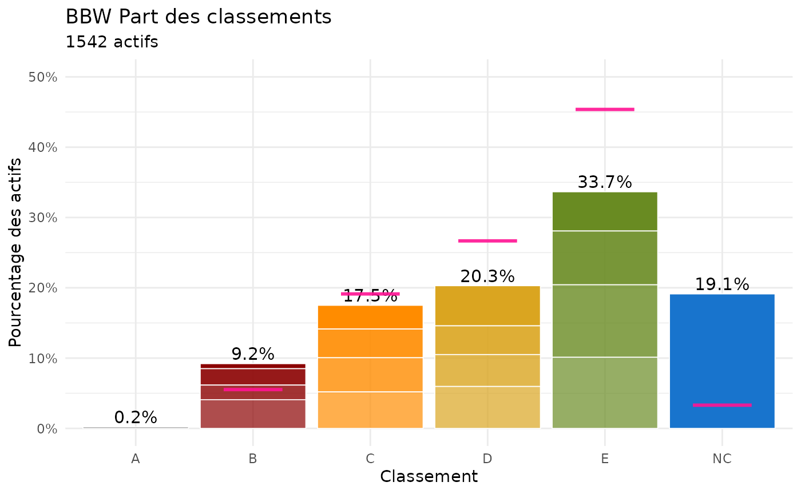
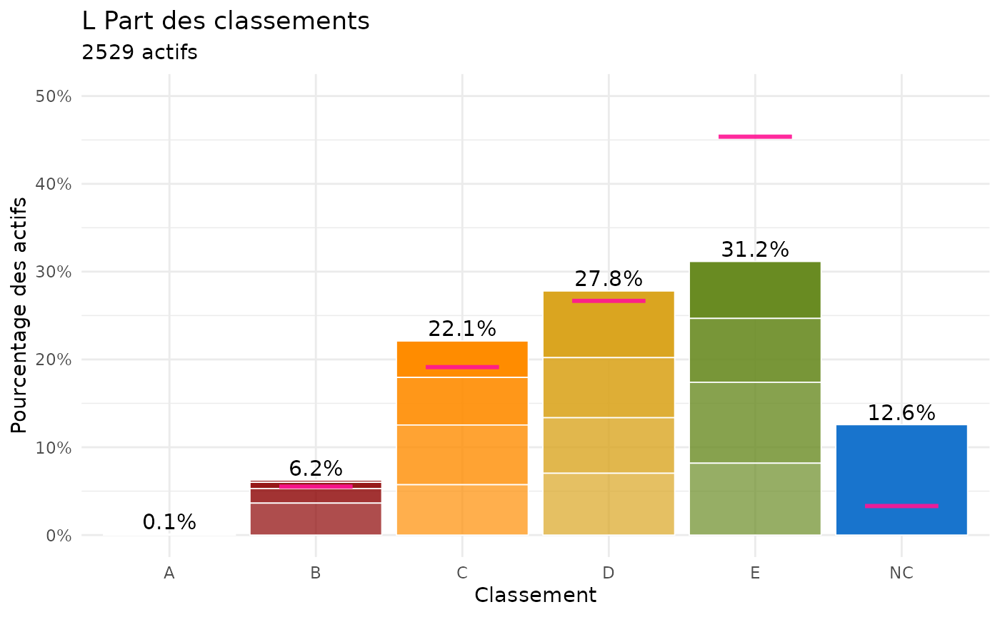
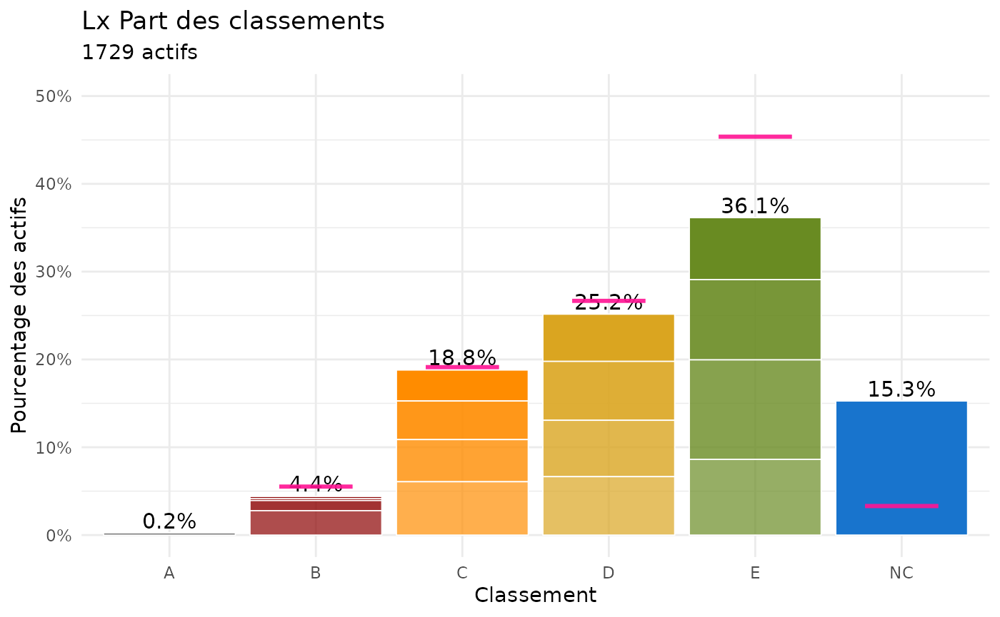
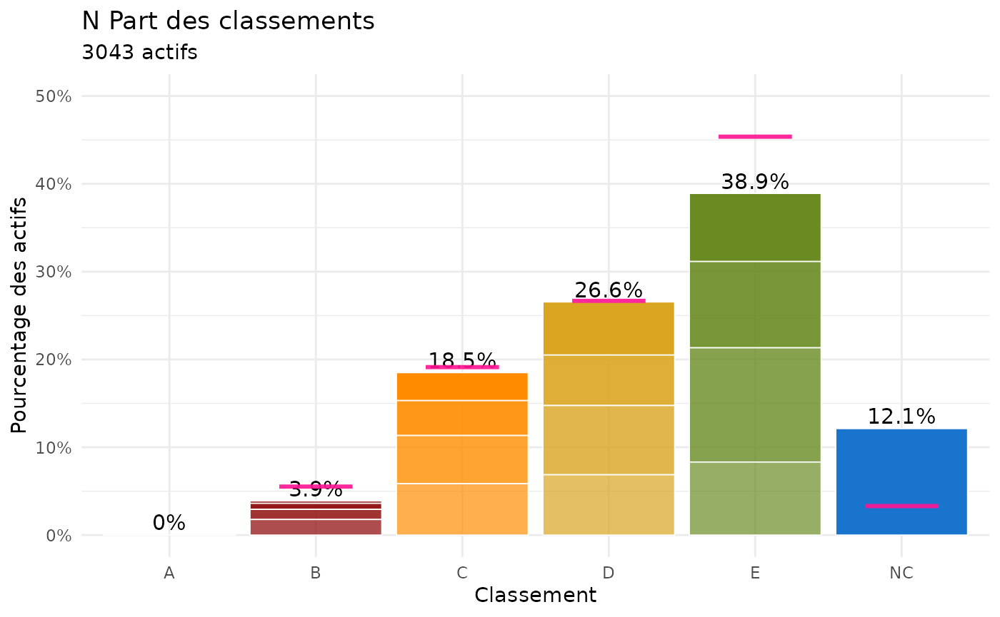
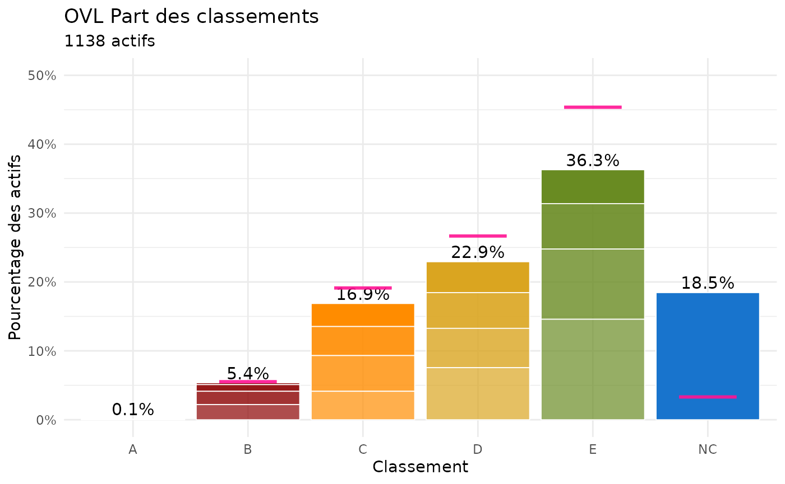
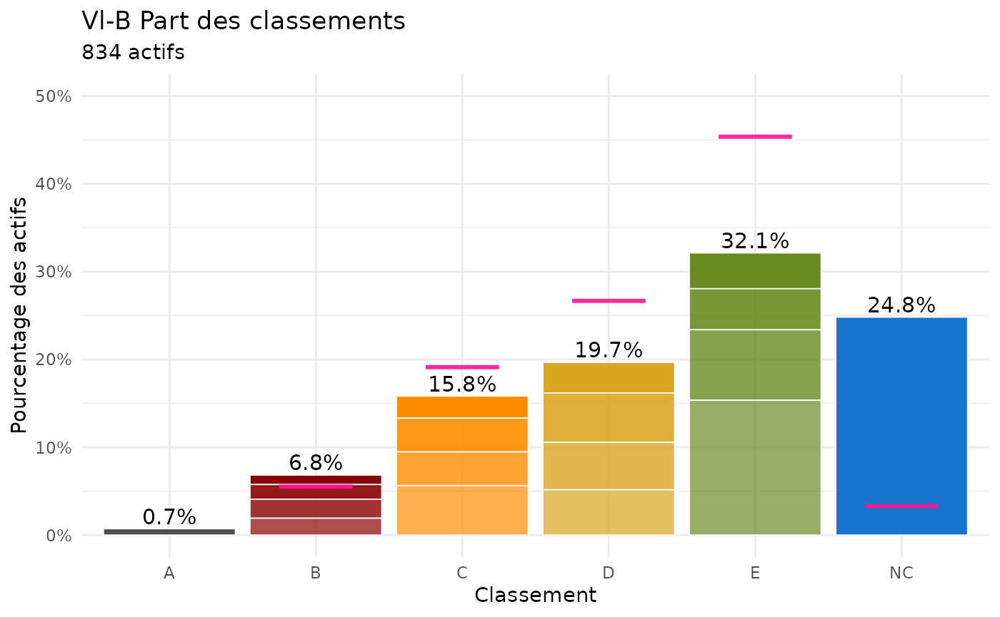

# Province Analysis

*To be cont’d*

## Analysis of current percentage of each classement

``` r

library(PingMeUp)
data("players_m", package = "PingMeUp")

library(ggridges)
library(ggplot2)
```

``` r

# Active players
table.actives.prov()
```

    ## 
    ##    A  BBW    H    L   LK   Lx    N  OVL Vl-B  WVL 
    ## 1151 1542 3672 2529  897 1729 3043 1138  834  876

Plot of the frequency of each classement for active players for each
province. The pink bar indicates the percentage of players in each
classement letter as of the AFTT grille (average, i.e. see
share.m.B2toNC()).

``` r

lapply(split(players_m, players_m$prov), function(df) {
  graph.pct.classements(df, ylim_max = 0.5,title = paste(unique(df$prov), "Part des classements"))+geom.pct.classements.grille()
})
```

    ## Best guess cumulated percentage based on means across columns of the provided grille. Excludes A's and B0 players as their number is fixed
    ## Best guess cumulated percentage based on means across columns of the provided grille. Excludes A's and B0 players as their number is fixed
    ## Best guess cumulated percentage based on means across columns of the provided grille. Excludes A's and B0 players as their number is fixed
    ## Best guess cumulated percentage based on means across columns of the provided grille. Excludes A's and B0 players as their number is fixed
    ## Best guess cumulated percentage based on means across columns of the provided grille. Excludes A's and B0 players as their number is fixed
    ## Best guess cumulated percentage based on means across columns of the provided grille. Excludes A's and B0 players as their number is fixed
    ## Best guess cumulated percentage based on means across columns of the provided grille. Excludes A's and B0 players as their number is fixed
    ## Best guess cumulated percentage based on means across columns of the provided grille. Excludes A's and B0 players as their number is fixed
    ## Best guess cumulated percentage based on means across columns of the provided grille. Excludes A's and B0 players as their number is fixed
    ## Best guess cumulated percentage based on means across columns of the provided grille. Excludes A's and B0 players as their number is fixed

    ## $A



graph.pct.classements.prov

    ## 
    ## $BBW



graph.pct.classements.prov

    ## 
    ## $H


graph.pct.classements.prov

    ## 
    ## $L



graph.pct.classements.prov

    ## 
    ## $LK


graph.pct.classements.prov

    ## 
    ## $Lx



graph.pct.classements.prov

    ## 
    ## $N



graph.pct.classements.prov

    ## 
    ## $OVL



graph.pct.classements.prov

    ## 
    ## $`Vl-B`



graph.pct.classements.prov

    ## 
    ## $WVL


graph.pct.classements.prov
