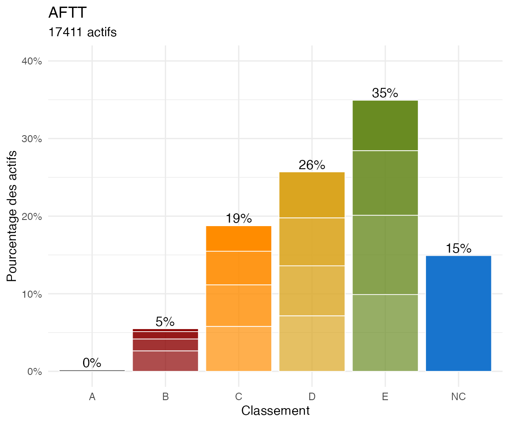

# Global Classements Analysis (all AFTT)

*To be cont’d*

## Analysis of current percentage of each classement

``` r
library(PingMeUp)
data("players_m", package = "PingMeUp")
```

``` r
# Active players
Actifs_AFTT <- players_m[players_m[, "position_bis"] != "Inactive", ]

# Actives by classement
tab_classement_Actifs_AFTT <- table(Actifs_AFTT[, "classement"])
pct_classement_AFTT <- tab_classement_Actifs_AFTT / nrow(Actifs_AFTT)

df_class_AFTT <- data.frame(
  classement = names(tab_classement_Actifs_AFTT),
  pct_classement_AFTT = round(as.numeric(pct_classement_AFTT),digits=4)
)
noAB0<-c("NC","E6","E4","E2","E0","D6","D4","D2","D0","C6","C4","C2","C0","B6","B4","B2")
df_class_AFTT[df_class_AFTT$classement %in% noAB0,]
```

    ##    classement pct_classement_AFTT
    ## 32         B2              0.0096
    ## 33         B4              0.0153
    ## 34         B6              0.0263
    ## 35         C0              0.0329
    ## 36         C2              0.0434
    ## 37         C4              0.0536
    ## 38         C6              0.0578
    ## 39         D0              0.0593
    ## 40         D2              0.0617
    ## 41         D4              0.0646
    ## 42         D6              0.0714
    ## 43         E0              0.0651
    ## 44         E2              0.0833
    ## 45         E4              0.1020
    ## 46         E6              0.0990
    ## 47         NC              0.1492

``` r
# Actives by classement letter
tab_lettre_Actifs_AFTT <- table(Actifs_AFTT[, "classement_lettre"])
pct_letter_AFTT <- tab_lettre_Actifs_AFTT / nrow(Actifs_AFTT)
pct_label_AFTT <- paste0(round(100 * pct_letter_AFTT), "%")

df_labels_AFTT <- data.frame(
  classement_lettre = names(tab_lettre_Actifs_AFTT),
  pct_letter_AFTT = as.numeric(pct_letter_AFTT),
  pct_label_AFTT = pct_label_AFTT
)
df_labels_AFTT
```

    ##   classement_lettre pct_letter_AFTT pct_label_AFTT
    ## 1                 A     0.001837919             0%
    ## 2                 B     0.054907817             5%
    ## 3                 C     0.187639998            19%
    ## 4                 D     0.257021423            26%
    ## 5                 E     0.349376831            35%
    ## 6                NC     0.149216013            15%

``` r
library(ggplot2)

AFTTplot <- ggplot(data = Actifs_AFTT) +
  geom_bar(
    aes(
      x = classement_lettre,
      fill = classement_lettre,
      alpha = classement_chiffre,
      y = after_stat(count / sum(count))
    ),
    col = "white",
    lwd = 0.3,
    show.legend = FALSE
  ) +
  scale_fill_manual(
    values = c(
      A  = "grey30",
      B  = "darkred",
      C  = "darkorange",
      D  = "goldenrod",
      E  = "olivedrab4",
      NC = "dodgerblue3"
    ),
    drop = FALSE
  ) +
  scale_alpha_manual(values = c(1, 0.9, 0.8, 0.7,1)) +
  scale_y_continuous(labels = scales::percent) +
  scale_x_discrete(drop = FALSE) +
  coord_cartesian(ylim = c(0, 0.4)) +
  theme_minimal() +
  labs(
    x = "Classement",
    y = "Pourcentage des actifs",
    title = "AFTT",
    subtitle = paste(nrow(Actifs_AFTT), "actifs")
  ) +
  geom_text(
    data = df_labels_AFTT,
    aes(x = classement_lettre, y = pct_letter_AFTT, label = pct_label_AFTT),
    vjust = -0.3,
    size = 4
  )

AFTTplot
```



## Estimate of new classement and analysis of change

``` r
players_m_new <- players.new.classement()
```

    ## Best guess cumulated percentage based on means across columns of the provided grille. Excludes A's and B0 players as their number is fixed

    ## 
    ## Transition table:
    ##      new
    ## old   NC  E6   E4   E2   E0   D6   D4   D2   D0   C6   C4  C2  C0  B6  B4  B2 
    ##   NC  516 1755 270  50   5    1    1    .    .    .    .   .   .   .   .   .  
    ##   E6  .   851  735  120  12   5    1    .    .    .    .   .   .   .   .   .  
    ##   E4  .   75   963  606  90   28   10   4    .    .    .   .   .   .   .   .  
    ##   E2  .   1    137  863  335  85   18   8    2    .    1   .   .   .   .   .  
    ##   E0  .   .    4    195  611  226  76   18   1    2    .   .   .   .   .   .  
    ##   D6  .   .    .    6    240  605  285  83   20   3    2   .   .   .   .   .  
    ##   D4  .   .    .    .    22   247  553  228  61   8    5   .   .   .   .   .  
    ##   D2  .   .    .    .    .    19   255  522  216  46   12  3   1   .   .   .  
    ##   D0  .   .    .    .    .    .    13   230  559  188  39  4   .   .   .   .  
    ##   C6  .   .    .    .    .    .    2    12   232  531  190 37  2   .   .   .  
    ##   C4  .   .    .    .    .    .    .    .    17   220  535 153 9   .   .   .  
    ##   C2  .   .    .    .    .    .    .    .    2    5    164 466 108 9   1   .  
    ##   C0  .   .    .    .    .    .    .    .    .    1    2   128 355 83  3   .  
    ##   B6  .   .    .    .    .    .    .    .    .    .    .   4   105 299 50  .  
    ##   B4  .   .    .    .    .    .    .    .    .    .    .   .   .   59  181 27 
    ##   B2  .   .    .    .    .    .    .    .    .    .    .   .   .   .   35  132
    ##   Sum 516 2682 2109 1840 1315 1216 1214 1105 1110 1004 950 795 580 450 270 159
    ##      new
    ## old   Sum  
    ##   NC  2598 
    ##   E6  1724 
    ##   E4  1776 
    ##   E2  1450 
    ##   E0  1133 
    ##   D6  1244 
    ##   D4  1124 
    ##   D2  1074 
    ##   D0  1033 
    ##   C6  1006 
    ##   C4  934  
    ##   C2  755  
    ##   C0  572  
    ##   B6  458  
    ##   B4  267  
    ##   B2  167  
    ##   Sum 17315

    ## 
    ## Difference table (number of players upward/downward by):
    ## 
    ##    -3    -2    -1     0     1     2     3     4     5     6     7   Sum 
    ##     5   105  2322  8542  5185   928   173    40    13     1     1 17315

``` r
attr(players_m_new, which="diff_table")
```

    ## 
    ##    -3    -2    -1     0     1     2     3     4     5     6     7   Sum 
    ##     5   105  2322  8542  5185   928   173    40    13     1     1 17315

``` r
plot(attr(players_m_new, which="diff_table")[-length(attr(players_m_new, which="diff_table"))])
```


