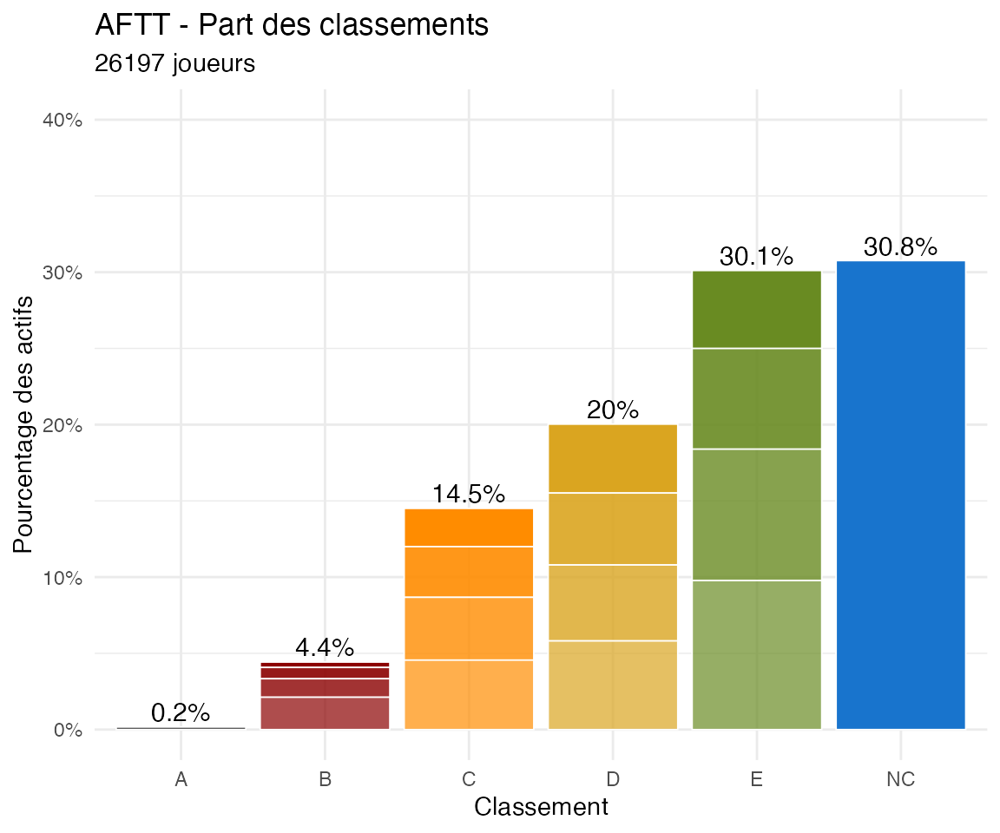
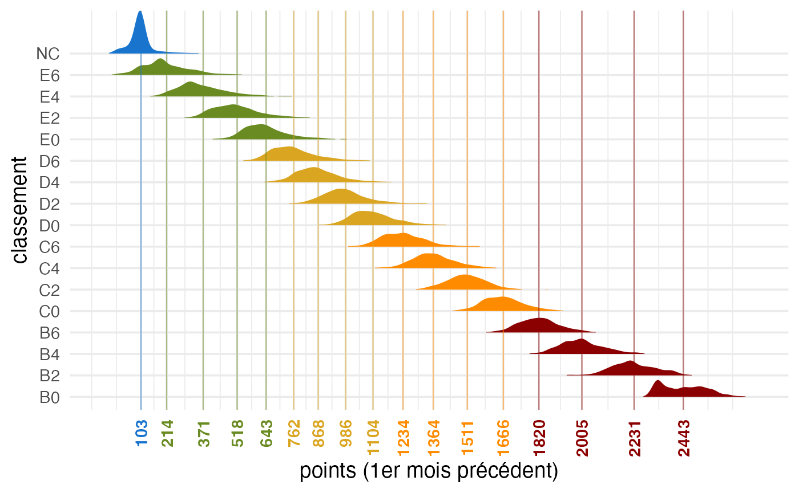

# Global Classements Analysis (all AFTT)

## Analysis of current percentage of each classement

``` r
library(PingMeUp)
data("players_m", package = "PingMeUp")

library(ggridges)
library(ggplot2)
```

``` r
# Active players
Actifs_AFTT <- players_m[players_m[, "position_bis"] != "Inactive", ]

# Actives by classement
tab_classement_Actifs_AFTT <- table(Actifs_AFTT[, "classement"])
pct_classement_AFTT <- tab_classement_Actifs_AFTT / nrow(Actifs_AFTT)

df_class_AFTT <- data.frame(
  classement = names(tab_classement_Actifs_AFTT),
  pct_classement_AFTT = round(as.numeric(pct_classement_AFTT),digits=4)
)
noAB0<-c("NC","E6","E4","E2","E0","D6","D4","D2","D0","C6","C4","C2","C0","B6","B4","B2")
df_class_AFTT[df_class_AFTT$classement %in% noAB0,]
```

    ##    classement pct_classement_AFTT
    ## 33         B2              0.0095
    ## 34         B4              0.0152
    ## 35         B6              0.0262
    ## 36         C0              0.0326
    ## 37         C2              0.0431
    ## 38         C4              0.0532
    ## 39         C6              0.0573
    ## 40         D0              0.0587
    ## 41         D2              0.0611
    ## 42         D4              0.0638
    ## 43         D6              0.0715
    ## 44         E0              0.0651
    ## 45         E2              0.0834
    ## 46         E4              0.1021
    ## 47         E6              0.1002
    ## 48         NC              0.1516

``` r
# Actives by classement letter
tab_lettre_Actifs_AFTT <- table(Actifs_AFTT[, "classement_lettre"])
pct_letter_AFTT <- tab_lettre_Actifs_AFTT / nrow(Actifs_AFTT)
pct_label_AFTT <- paste0(round(100 * pct_letter_AFTT), "%")

df_labels_AFTT <- data.frame(
  classement_lettre = names(tab_lettre_Actifs_AFTT),
  pct_letter_AFTT = as.numeric(pct_letter_AFTT),
  pct_label_AFTT = pct_label_AFTT
)
df_labels_AFTT
```

    ##   classement_lettre pct_letter_AFTT pct_label_AFTT
    ## 1                 A     0.001868947             0%
    ## 2                 B     0.054482641             5%
    ## 3                 C     0.186215099            19%
    ## 4                 D     0.255082970            26%
    ## 5                 E     0.350795718            35%
    ## 6                NC     0.151554624            15%

Plot of the frequency of each classement for all AFTT players (actives
or all)

``` r
graph.pct.classements(players_m)
```


graph.pct.classements

``` r
graph.pct.classements(players_m,actifs_only = FALSE)
```



graph.pct.classements

## Analysis of points per classement

``` r
players_AFTT_noA <- players_m[players_m$classement_lettre != "A", ]
players_AFTT_noA$classement <- factor(players_AFTT_noA$classement)
Points_class_qt <- aggregate(points ~ classement, data = players_AFTT_noA, FUN = quantile)
Points_class_qt <- do.call(data.frame, Points_class_qt)

Points_class_mean <- aggregate(points ~ classement, data = players_AFTT_noA, FUN = mean)
Points_class <- merge(Points_class_mean, Points_class_qt, by = "classement")
names(Points_class) <- c("classement",
                         "mean_pts",
                         "min_pts",
                         "qt25_pts",
                         "median_pts",
                         "qt75_pts",
                         "max_pts")

Points_class
```

    ##    classement  mean_pts min_pts   qt25_pts median_pts  qt75_pts max_pts
    ## 1          B0 2443.2250 2308.80 2336.84250  2437.1750 2518.4000 2693.33
    ## 2          B2 2230.8075 1951.76 2164.06250  2220.4500 2299.7125 2588.81
    ## 3          B4 2005.3390 1789.25 1939.97250  2000.0050 2064.3125 2257.48
    ## 4          B6 1819.7831 1542.13 1758.84000  1819.1900 1872.7250 2151.25
    ## 5          C0 1666.3295 1231.81 1602.14000  1661.6500 1721.6400 1998.33
    ## 6          C2 1510.9754 1146.34 1452.38000  1507.8600 1565.8650 1937.76
    ## 7          C4 1364.4459 1081.06 1305.61500  1359.6800 1421.0900 1745.58
    ## 8          C6 1233.6977  847.37 1164.45000  1227.6700 1293.5900 1692.14
    ## 9          D0 1103.9694  826.76 1036.95000  1092.9250 1158.4675 1559.98
    ## 10         D2  986.1742  718.15  918.18750   975.3400 1033.2650 1596.69
    ## 11         D4  867.8052  624.56  801.08000   855.1300  919.9700 1428.47
    ## 12         D6  762.2220  476.49  687.00000   747.6200  814.1700 1462.83
    ## 13         E0  642.9184  293.50  570.69250   627.9100  692.1700 1331.31
    ## 14         E2  517.9013  192.56  438.19000   503.2800  572.9925 1388.59
    ## 15         E4  371.4050   68.00  294.16000   348.9000  429.3350 1049.90
    ## 16         E6  213.7815    0.00  140.24500   187.4475  270.4350  845.50
    ## 17         NC  103.1423    0.00   93.33125   100.0000  100.0000  698.90

``` r
classement_cols <- c(B0 = "darkred",B2 = "darkred",B4 = "darkred",
  B6 = "darkred",C0 = "darkorange",C2 = "darkorange",
  C4 = "darkorange",C6 = "darkorange",D0 = "goldenrod",
  D2 = "goldenrod",D4 = "goldenrod",D6 = "goldenrod",
  E0 = "olivedrab4",E2 = "olivedrab4",E4 = "olivedrab4",
  E6 = "olivedrab4",NC = "dodgerblue3")

ggplot(players_AFTT_noA,
       aes(x = points,y = classement,
         fill = classement, color = classement)) +
  geom_density_ridges(scale = 2, rel_min_height = 0.01,
                      color = NA) +
  geom_vline(data = Points_class,
    aes(xintercept = mean_pts, color = classement),
    linewidth = 0.4, alpha = 0.5) +
  scale_fill_manual(values = classement_cols) +
  scale_color_manual(values = classement_cols) +
  scale_x_continuous(breaks = Points_class$mean_pts,
                     labels = round(Points_class$mean_pts, 0)) +
  theme_minimal(base_size = 14) +
  xlab("points (1er mois précédent)") +
  theme(axis.text.x = element_text(angle = 90,vjust = 0.5,
                                   hjust = 1,
                                   color = classement_cols[Points_class$classement],face = "bold"),
        legend.position = "none")
```

    ## Picking joint bandwidth of 20.7



Points_class

## Estimate of new classement and analysis of change

To estimate the new classement for a series of players, use the
[`players.new.classement()`](https://geocaruso.github.io/PingMeUp/reference/players.new.classement.md)
function. It is based on current points of each players and the total
number of active players retrieved by
[`count.actives()`](https://geocaruso.github.io/PingMeUp/reference/count.actives.md).
The function adds 2 columns in the data frame: the new classement
(`classement_new`) and the number of classements upward or downward
(`classement_diff`). After computing, two tables are displayed,
showing - a transition table with frequencies of players in each pair of
old to new classement. Most players (about 50%) don’t change of
classement hence the diagonal is strong. Also there are more upward
changes than downward changes, meaning training efforts generally
pays-off! However you will notice that from D4 and upper, there is
usually more people going one classement down than up. - a difference
table, where we see most players don’t change of classement and only few
gain 3 or more classements in a season. The average is around 0.3
classement, which is a rate to which every club or province could
compare as a way to measure performance.

Applied to all players (default), the computation gives:

``` r
count.actives()
```

``` small-text
## [1] 17657
```

``` r
players_m_new <- players.new.classement()
```

    ## Best guess cumulated percentage based on means across columns of the provided grille. Excludes A's and B0 players as their number is fixed

    ## 
    ## Transition table:
    ##      new
    ## old   NC  E6   E4   E2   E0   D6   D4   D2   D0   C6   C4  C2  C0  B6  B4  B2 
    ##   NC  527 1780 305  53   10   1    .    .    .    .    .   .   .   .   .   .  
    ##   E6  .   855  748  145  13   7    2    .    .    .    .   .   .   .   .   .  
    ##   E4  .   80   948  615  108  34   11   4    2    .    .   .   .   .   .   .  
    ##   E2  .   1    134  852  352  101  17   11   3    1    1   .   .   .   .   .  
    ##   E0  .   .    4    191  590  253  85   19   5    1    1   .   .   .   .   .  
    ##   D6  .   .    .    10   242  576  310  90   28   4    1   1   .   .   .   .  
    ##   D4  .   .    .    .    20   241  539  242  67   12   6   .   .   .   .   .  
    ##   D2  .   .    .    .    .    17   248  521  225  47   16  3   1   .   .   .  
    ##   D0  .   .    .    .    .    .    16   225  546  205  40  5   .   .   .   .  
    ##   C6  .   .    .    .    .    .    2    12   229  524  208 35  2   .   .   .  
    ##   C4  .   .    .    .    .    .    .    .    19   217  524 167 12  .   .   .  
    ##   C2  .   .    .    .    .    .    .    .    1    7    165 463 111 13  1   .  
    ##   C0  .   .    .    .    .    .    .    .    .    1    3   126 354 88  4   .  
    ##   B6  .   .    .    .    .    .    .    .    .    .    .   5   110 293 53  1  
    ##   B4  .   .    .    .    .    .    .    .    .    .    .   .   .   61  181 26 
    ##   B2  .   .    .    .    .    .    .    .    .    .    .   .   .   .   31  137
    ##   Sum 527 2716 2139 1866 1335 1230 1230 1124 1125 1019 965 805 590 455 270 164
    ##      new
    ## old   Sum  
    ##   NC  2676 
    ##   E6  1770 
    ##   E4  1802 
    ##   E2  1473 
    ##   E0  1149 
    ##   D6  1262 
    ##   D4  1127 
    ##   D2  1078 
    ##   D0  1037 
    ##   C6  1012 
    ##   C4  939  
    ##   C2  761  
    ##   C0  576  
    ##   B6  462  
    ##   B4  268  
    ##   B2  168  
    ##   Sum 17560

    ## 
    ## Difference table (number of players upward/downward by):
    ## 
    ##    -3    -2    -1     0     1     2     3     4     5     6     7   Sum 
    ##     4   114  2300  8430  5383  1053   200    57    13     5     1 17560

``` r
summary(players_m_new$classement_diff)
```

``` small-text
##    Min. 1st Qu.  Median    Mean 3rd Qu.    Max.    NA's 
## -3.0000  0.0000  0.0000  0.3348  1.0000  7.0000    8637
```

``` r
attr(players_m_new, which="diff_table")
```

    ## 
    ##    -3    -2    -1     0     1     2     3     4     5     6     7   Sum 
    ##     4   114  2300  8430  5383  1053   200    57    13     5     1 17560

``` r
plot(attr(players_m_new, which="diff_table")[-length(attr(players_m_new, which="diff_table"))],
     main="Montées et descentes de classement",
     xlab ="Nombre de classements en plus ou moins",
     ylab ="Fréquence (nombre de joueurs)")
```


